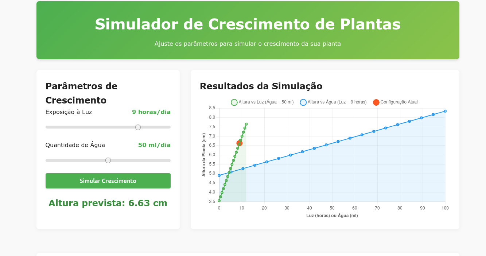

# Simulador de Crescimento de Plantas 🌱

Um aplicativo web interativo que simula o crescimento de plantas com base em fatores ambientais, utilizando Planejamento de Experimentos (DOE) e modelagem estatística.



##  Sobre o Projeto

Este simulador permite aos usuários prever a altura de plantas com base em dois fatores críticos de crescimento:
- **Luz solar** (0-12 horas por dia)
- **Água** (0-100 ml por dia)

A altura prevista é calculada a partir de um modelo estatístico desenvolvido usando dados experimentais e técnicas de regressão. O aplicativo não apenas fornece previsões pontuais, mas também visualiza como cada fator influencia o crescimento da planta.

##  Funcionalidades

- Interface interativa para ajuste dos parâmetros de crescimento
- Visualização em tempo real do crescimento previsto da planta
- Gráficos dinâmicos mostrando a relação entre fatores ambientais e altura da planta
- Detalhes sobre o modelo estatístico e sua interpretação

##  Tecnologias Utilizadas

- **Backend**: Flask, Python 3.12.4
- **Análise Estatística**: NumPy, StatsModels
- **Frontend**: HTML5, CSS3, JavaScript
- **Visualização**: Chart.js

##  Modelo Estatístico

O simulador usa um modelo de regressão linear baseado em Planejamento de Experimentos (DOE), com as seguintes métricas de qualidade:

- **R²**: 0.978
- **R² Ajustado**: 0.961
- **F-statistic**: 58.74
- **p-value**: 0.000917

O modelo identifica que tanto luz quanto água têm impacto significativo no crescimento das plantas, com a luz tendo um efeito ligeiramente maior. Existe também um efeito de interação positivo entre os dois fatores.

##  Como Executar

### Pré-requisitos

- Python 3.12 ou superior
- pip (gerenciador de pacotes Python)

### Instalação

1. Clone o repositório:
   ```bash
   git clone https://github.com/esscova/plant-growth-simulator.git
   cd plant-growth-simulator
   ```

2. Crie e ative um ambiente virtual (opcional, mas recomendado):
   ```bash
   python -m venv venv
   source venv/bin/activate  # No Windows: venv\Scripts\activate
   ```

3. Instale as dependências:
   ```bash
   pip install -r requirements.txt
   ```

4. Execute a aplicação:
   ```bash
   python app.py
   ```

5. Acesse a aplicação no navegador:
   ```
   http://localhost:5000
   ```

## 📁 Estrutura do Projeto

```
plant-growth-simulator/
├── app.py              # Aplicação Flask e modelagem estatística
├── notebook            # Notebook com experimento
├── templates/          # Templates HTML
│   └── index.html      # Interface do usuário
├── static/             # Arquivos estáticos (CSS, JS)
├── requirements.txt    # Dependências do projeto
└── README.md           # Este arquivo
```

##  Dados Experimentais

O modelo é baseado em dados experimentais coletados em condições controladas, com um design fatorial 2² com pontos centrais. A matriz de experimentos inclui diferentes combinações de níveis de luz e água, permitindo estimar tanto os efeitos principais quanto as interações.

##  Uso e Interpretação

Para usar o simulador:
1. Ajuste os controles deslizantes para os níveis desejados de luz e água
2. Clique em "Simular Crescimento"
3. Observe a altura prevista e as curvas de resposta no gráfico

As curvas do gráfico mostram como a altura da planta muda quando você varia um fator enquanto mantém o outro constante, ajudando a identificar condições ideais de crescimento.

## Autor

**Wellington M Santos** - [GitHub](https://github.com/esscova)


---

Desenvolvido como parte de um estudo sobre aplicação de técnicas estatísticas em modelos de crescimento botânico.